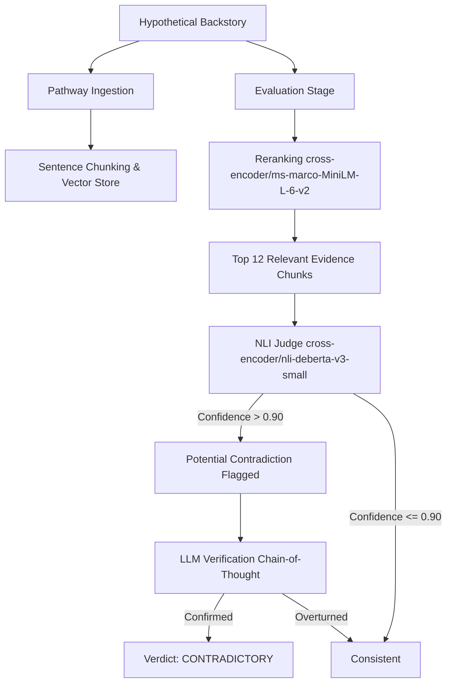

# Narrative Consistency Pipeline — Architecture

## System Overview

The **EpochZero** pipeline is a multi-stage hybrid reasoning engine designed to detect contradictions between a given **Hypothetical Backstory** and a large corpus of **Novel Evidence**.

## Key Components

### 1. Ingestion & Retrieval (Pathway)
- **Pathway Vector Store**: Real-time indexing of novel chapters.
- **Reranker**: Uses `cross-encoder/ms-marco-MiniLM-L-6-v2` to select the most relevant evidence chunks from the initial vector search results. Context window optimized for 12-20 chunks.

### 2. NLI Filter (Natural Language Inference)
- **Model**: `cross-encoder/nli-deberta-v3-small`.
- **Strategy**: Acts as a high-recall filter to identify potential atomic claim conflicts.
- **Thresholds**:
    - **Strong**: 0.90 (Flags for LLM verification).
    - **Entailment Override**: 0.40 (If any evidence strongly supports the claim, the contradiction flag is cleared).
    - **Temporal Check**: Custom regex-based logic to detect year conflicts (e.g., 1815 vs 1835).

### 3. LLM Verification (The Judge)
- **Strategy**: **Chain-of-Thought (CoT)** reasoning.
- **Inference**: Conducted via **LiteLLM Rotator** (Groq-Llama-3/8B) locally.
- **Logic**: The LLM is given the backstory and raw evidence. It is instructed to "think step-by-step" before issuing a final `VERDICT`. This stage removes NLI false positives by understanding the semantic nuances of the narrative.

---

## Metric Tracking (Current)

| Metric | Version | Accuracy |
|---|---|---|
| **Baseline** | NLI Only | ~50% |
| **JSON Mode** | NLI → JSON LLM | 63.75% |
| **V1.0 (Current)** | **NLI → CoT LLM** | **65.00%** |
