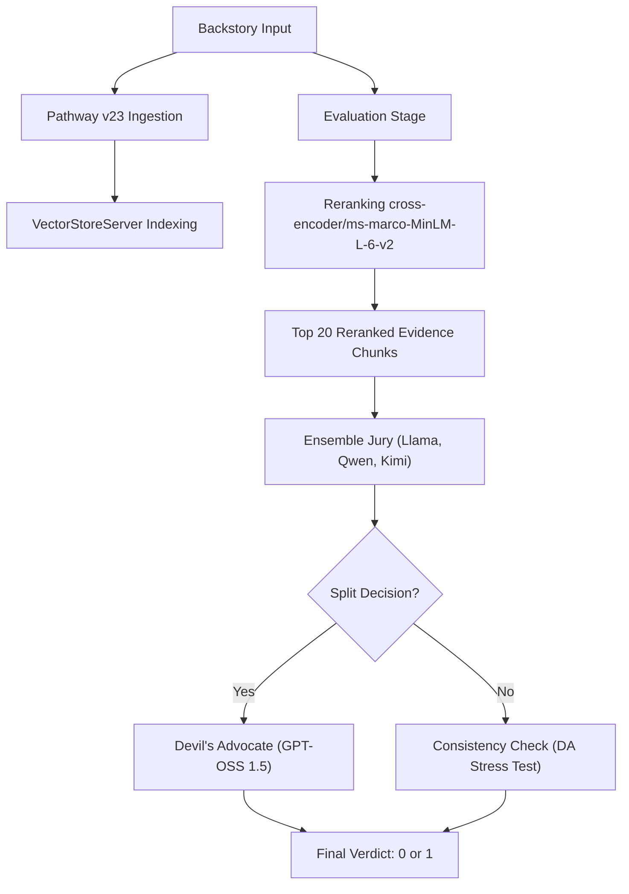

# Narrative Consistency Pipeline — Architecture

## System Overview

The **EpochZero** pipeline is a high-precision hybrid reasoning engine designed for detecting narrative contradictions. Version 3.0 (Strategy 5: **Balanced Aggression**) represents the current performance peak, utilizing a multi-tier rule-based jury.

## Key Components

### 1. Ingestion & Retrieval (Pathway v23)
- **Pathway Vector Store**: Migrated to `VectorStoreServer` for improved concurrency.
- **Reranker**: Uses `cross-encoder/ms-marco-MiniLM-L-6-v2` to audit search results. Optimized at **20 reranked snippets**.

### 2. NLI Reranking & Veto
- **Model**: `cross-encoder/nli-deberta-v3-small`.
- **Role**: Identifies evidence strength, providing the jury with focused reasoning material.

### 3. Balanced Aggression Jury (The Judge)
- **Base Jury**: Parallel ensemble of Llama 3.3, Qwen 2.5, and Kimi 1.5 via Groq.
- **Devil's Advocate**: GPT-OSS 1.5 120B arbitrator.
- **Logic**: Enforces a `CONTRADICTION_SCORE` (1-10) and mandatory `DIRECT_QUOTE` verification for all overrides.

---

## Metric Tracking (Evolution)

| Phase | Strategy | Accuracy |
|---|---|---|
| **Baseline** | NLI Only | ~50% |
| **V1.0** | NLI-First (Llama-3 Audit) | 65.00% |
| **V2.0** | LLM-First (DeepSeek R1 + Top-20 Rerank) | 68.75% |
| **V3.0 (Current)**| **Balanced Aggression (Ensemble + DA)** | **69.01%** |
