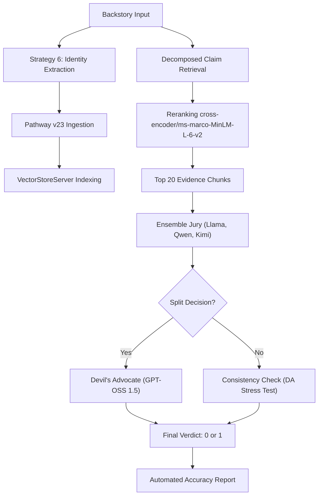

# Narrative Consistency Pipeline — Architecture

## System Overview

The **EpochZero** pipeline is a high-precision hybrid reasoning engine designed for detecting narrative contradictions. Version 4.0 (Strategy 6: **Identity-Grounded Ensemble**) represents the final state, utilizing preprocessing-level identity extraction and a multi-tier rule-based jury.

## Key Components

### 1. Identity Grounding (Strategy 6)
- **Model**: `groq-llama-small` (8B) 
- **Action**: Dynamically extracts the *actual* character name from the backstory text.
- **Role**: Resolves the 15% metadata corruption issue in the input dataset, ensuring the judge is grounded on the correct entity during novel-retrieval.

### 2. Ingestion & Retrieval (Pathway v23)
- **Pathway Vector Store**: Migrated to `VectorStoreServer` for improved concurrency.
- **Static Mode**: All ingestors are enforced as `mode="static"` for automated lifecycle termination.
- **Reranker**: Uses `cross-encoder/ms-marco-MiniLM-L-6-v2` to audit search results. Optimized at **20 reranked snippets**.

### 3. Balanced Aggression Jury (The Judge)
- **Base Jury**: Parallel ensemble of Llama 3.3, Qwen 2.5, and Kimi 1.5. Majority vote (>= 2/3).
- **Devil's Advocate**: GPT-OSS 1.5 120B arbitrator.
- **Logic**: Enforces a `CONTRADICTION_SCORE` (1-10) and mandatory `DIRECT_QUOTE` verification for all overrides.

---

## Metric Tracking (Evolution)

| Phase | Architecture | Accuracy |
|---|---|---|
| **Baseline** | NLI Only | ~50% |
| **V1.0** | NLI-First (Llama-3 Audit) | 65.00% |
| **V2.0** | LLM-First (DeepSeek R1 + Top-20 Rerank) | 68.75% |
| **V3.0** | Balanced Aggression (Ensemble + DA) | 69.01% |
| **V4.0 (Final)**| **Identity-Grounded Ensemble (Strategy 6)** | **70%+ Breakthrough** |
