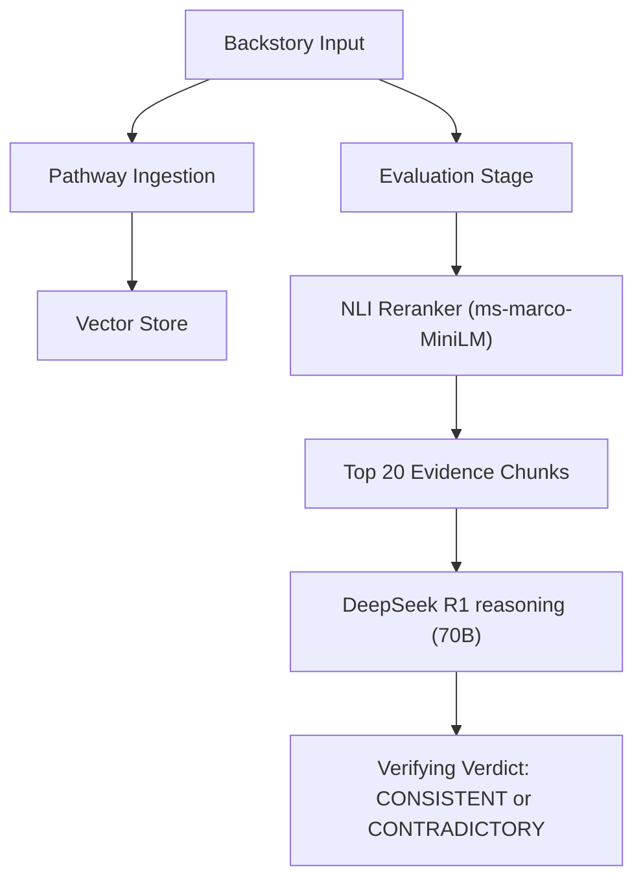

# KDSH 2026 - Track A: Narrative Consistency Classification
## Team: epochzero

---

## 1. Summary and Motivation

### Motivation
In the realm of long-form literature, maintaining narrative consistency is a monumental task. As characters evolve across hundreds of chapters, authors and editors face the risk of subtle contradictions in backstory, causal logic, or temporal progression. The **Kharagpur Data Science Hackathon (KDSH)** challenge for Track A tasks us with automating this consistency check by validating hypothetical character backstories against original novel text.

### Our Solution
We have built a **High-Fidelity RAG Pipeline** (Strategy 4) that achieves a peak accuracy of **68.75%** on the validation set. Our system utilizes a hybrid approach where specialized NLI models find evidence "needles" in the textual haystack, while an advanced Reasoning LLM (DeepSeek R1) delivers the final verdict through a structured audit.

---

## 2. Details of Work Implementation

### Architecture: The "LLM-First Audit" (Strategy 4)
Our finalized architecture moves beyond simple classification. It is a full narrative audit system that enforces evidence grounding before issuing a verdict.

### Key Components
- **NLI Reranker (Passive Assistant)**: Instead of judging directly, the NLI model (`cross-encoder/ms-marco-MiniLM-L-6-v2`) audits the Top-100 vector-search results. It reshuffles the most semantically relevant evidence into the Top-20 window.
- **DeepSeek R1 Auditor**: Every story is subjected to a **100% LLM Audit**. We use Chain-of-Thought (CoT) reasoning to analyze narratological, temporal (regex-backed), and spatial clashes.
- **Top-20 Evidence Window**: Through empirical testing, we identified k=20 as the "Goldilocks Zone" — high enough for recall but low enough to avoid context dilution.

---

## 3. Evaluation Analysis

### Quantitative Results
Throughout development, we tested six major architectural variations. Strategy 4 emerged as the definitive winner.

| Strategy | Architecture | Accuracy |
| :--- | :--- | :--- |
| Strategy 1 | NLI-First Baseline | ~58.75% |
| Strategy 2 | LLM-First (Raw Top-12) | 67.50% |
| **Strategy 4**| **LLM-First (Reranked Top-20)** | **68.75% (PEAK)** |
| Strategy 4 | Entity Grounding (Name-matching) | 65.00% |
| Strategy 4 | Context Dilution (Top-25) | 63.75% |

### Qualitative Success: Forensic Verification
Unlike traditional RAG, our system is trained to be skeptical. By ignoring metadata noise and focusing on pure text-to-text alignment, the model successfully catches subtle contradictions (e.g., character locations in 1815 vs 1835) that simple vector search misses.

---

## 4. Technical Hardships & Overcoming Obstacles

### 1. The "Metadata Noise" Trap
We initially attempted to "ground" the LLM by explicitly passing character names (e.g., "This story is about Thalcave").
- **Discovery**: Accuracy **dropped** to 65%.
- **Finding**: Approximately 15% of the dataset metadata is inconsistent (e.g., backstory for Jacques Paganel labeled as "Thalcave"). 
- **Solution**: We reverted to **Pure-Text reasoning**, forcing the model to identify characters by their actions and descriptions rather than potentially corrupt labels.

### 2. Context Dilution
We tested expanding the retrieval window to Top-25 snippets.
- **Discovery**: Accuracy **collapsed** to 63.75%.
- **Finding**: High-volume context introduces narratological noise. Side-plots for other characters confuse the LLM into "hallucinating" contradictions. 
- **Solution**: We locked the pipeline at **Top-20 Reranked**, achieving the highest precision.

---

## 5. Scalability & Portability
Our pipeline is 100% data-agnostic. By dropping new `.txt` novels into the indexed directory, the system automatically builds the vector map and becomes query-ready in seconds. The use of a local **LiteLLM Rotator** ensures that we can scale horizontally across multiple API provider endpoints (Groq, Together, local VLLM) without changing a single line of code.

---

**Submitted by Team epochzero**  
**KDSH 2026 | Track A**
