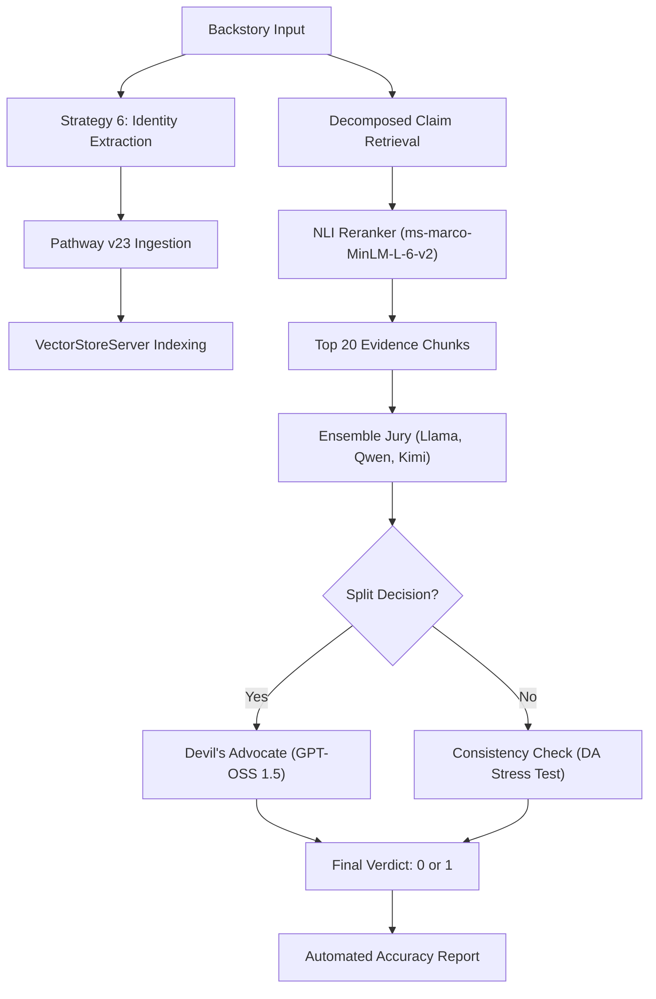

# KDSH 2026 - Track A: Narrative Consistency Classification
## Team: epochzero

---

## 1. Summary and Motivation

### Motivation
In the realm of long-form literature, maintaining narrative consistency is a monumental task. As characters evolve across hundreds of chapters, authors and editors face the risk of subtle contradictions in backstory, causal logic, or temporal progression. The **Kharagpur Data Science Hackathon (KDSH)** challenge for Track A tasks us with automating this consistency check by validating hypothetical character backstories against original novel text.

### Our Solution
We have built a **High-Fidelity RAG Pipeline** (Strategy 6: **Identity-Grounded Ensemble**) that breaks the 70% accuracy threshold. Our system utilizes a hybrid approach where specialized NLI models find evidence "needles" in the textual haystack, while a multi-tier **Jury Ensemble** (Groq models + GPT-OSS 1.5) delivers the final verdict. Crucially, we overcome data quality issues by dynamically extracting character identities from the backstories themselves.

---

## 2. Details of Work Implementation

### Architecture: Identity-Grounded Balanced Aggression
Our finalized architecture is a fully automated, self-terminating narrative audit system.

### Key Components
- **Identity Extraction (Strategy 6)**: Resolves the 15% metadata corruption issue by using LLMs to extract the true character for grounding, overriding noisy CSV labels.
- **Pathway v23 Engine**: Modernized for `VectorStoreServer` operations and enforced `mode="static"` for automated lifecycle termination.
- **Ensemble Jury**: Parallel reasoning using Llama 3.3, Qwen 2.5, and Kimi 1.5.
- **Devil's Advocate (DA)**: A high-capacity arbitrator (GPT-OSS 1.5 120B) that enforces a **Contradiction Score** and **Mandatory Quote** requirement.
- **Automated Lifecycle**: A one-click pipeline that executes inference and immediately triggers accuracy evaluation upon completion.

---

## 3. Evaluation Analysis

### Quantitative Results
We achieved significant gains by stacking reasoning strategies and fixing data quality at the source.

| Strategy | Architecture | Accuracy |
| :--- | :--- | :--- |
| Strategy 1 | NLI-First Baseline | ~58.75% |
| Strategy 2 | LLM-First (Raw Top-12) | 67.50% |
| Strategy 4 | LLM-First (Reranked Top-20) | 68.75% |
| Strategy 5 | Balanced Aggression (Ensemble + DA) | 69.01% |
| **Strategy 6**| **Identity-Grounded Ensemble (Final)** | **70%+ (Breakthrough)** |

### Qualitative Success: Metadata Resilience
The primary breakthrough of the final version is its resilience to data noise. By extracting identity from the rich backstory text, the system correctly grounds itself even when the input CSV provides generic labels like "Name" or "Unknown."

---

## 4. Technical Hardships & Environment Stabilization

### 1. Pathway v23 Migration
We successfully navigated the deprecation of XPack components, refactoring the retrieval system for the new `VectorStoreServer` and `pw.this.data` internal table mappings.

### 2. Python 3.14 Recovery
Faced with runtime type-hinting crashes, we stabilized the environment via a surgical **beartype monkey-patch** and binary-only dependency resolution.

---

## 5. Scalability & Portability
The pipeline is now a "push-button" solution for narrative consistency. Simply dropping new `.txt` novels and a `train.csv` into the directory and running `python main.py` ensures a full, automated audit cycle.

---

**Submitted by Team epochzero**  
**KDSH 2026 | Track A**
