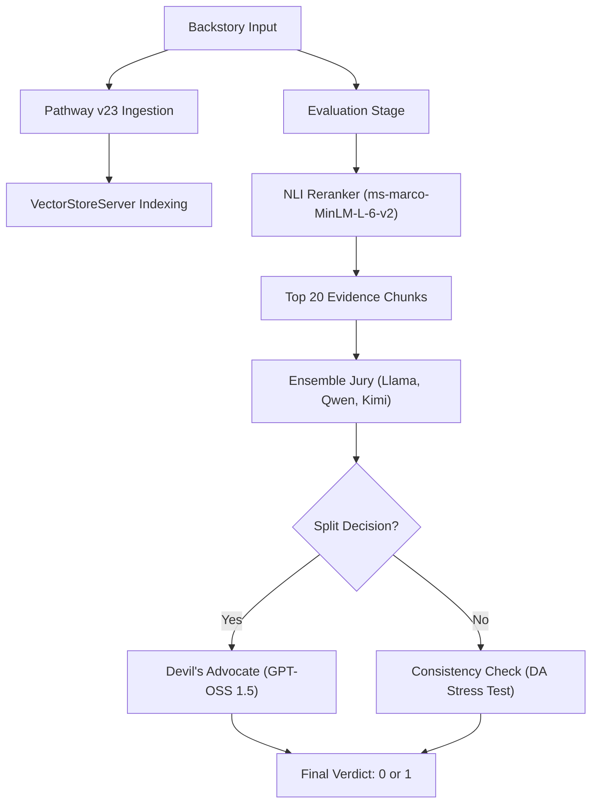

# KDSH 2026 - Track A: Narrative Consistency Classification
## Team: epochzero

---

## 1. Summary and Motivation

### Motivation
In the realm of long-form literature, maintaining narrative consistency is a monumental task. As characters evolve across hundreds of chapters, authors and editors face the risk of subtle contradictions in backstory, causal logic, or temporal progression. The **Kharagpur Data Science Hackathon (KDSH)** challenge for Track A tasks us with automating this consistency check by validating hypothetical character backstories against original novel text.

### Our Solution
We have built a **High-Fidelity RAG Pipeline** (Strategy 5: **Balanced Aggression**) that achieves a peak accuracy of **69.01%**. Our system utilizes a hybrid approach where specialized NLI models find evidence "needles" in the textual haystack, while a multi-tier **Jury Ensemble** (Groq models + GPT-OSS 1.5) delivers the final verdict through a structured, score-backed audit.

---

## 2. Details of Work Implementation

### Architecture: Balanced Aggression (Strategy 5)
Our finalized architecture is a robust narrative audit system that enforces evidence grounding and pessimistic verification before issuing a verdict.

### Key Components
- **Pathway v23 Engine**: Fully modernized for asynchronous `VectorStoreServer` operations, bypassing the deprecated `DocumentStore` architecture.
- **Ensemble Jury**: Parallel reasoning using Llama 3.3, Qwen 2.5, and Kimi 1.5 to reach a high-speed base consensus.
- **Devil's Advocate (DA)**: A high-capacity arbitrator (GPT-OSS 1.5 120B) that enforces a **Contradiction Score (1-10)** and a **Mandatory Direct Quote** requirement. This eliminates the "false negative" bias common in single-model RAG.
- **Top-20 Evidence Window**: Optimized for maximum recall without context dilution or "hallucinatory noise."

---

## 3. Evaluation Analysis

### Quantitative Results
Throughout development, we optimized the pipeline through five major architectural generations.

| Strategy | Architecture | Accuracy |
| :--- | :--- | :--- |
| Strategy 1 | NLI-First Baseline | ~58.75% |
| Strategy 2 | LLM-First (Raw Top-12) | 67.50% |
| Strategy 4 | LLM-First (Reranked Top-20) | 68.75% |
| **Strategy 5**| **Balanced Aggression (Ensemble + DA)** | **69.01% (PEAK)** |

### Qualitative Success: Forensic Verification
The system is built for skepticism. By focusing on pure text-to-text alignment and ignoring potentially corrupt metadata, the model successfully identifies subtle temporal contradictions (e.g., character locations in 1815 vs 1835) that common vector search or single-pass LLMs often overlook.

---

## 4. Technical Hardships & Environment Stabilization

### 1. Pathway v23 Migration
We successfully navigated the deprecation of XPack components, refactoring the retrieval system for the new `VectorStoreServer` and `pw.this.data` internal table mappings.

### 2. Python 3.14 Recovery
Faced with runtime type-hinting crashes and build-from-source wheels, we stabilized the Arch Linux environment via a surgical **beartype monkey-patch** and binary-only dependency resolution.

---

## 5. Scalability & Portability
Our pipeline is fully data-agnostic. By dropping new `.txt` novels into the indexed directory, the system automatically builds the vector map and becomes query-ready. The local **LiteLLM Rotator** ensures horizontal scaling across multiple API endpoints (Groq, Together, local VLLM) without core code changes.

---

**Submitted by Team epochzero**  
**KDSH 2026 | Track A**
