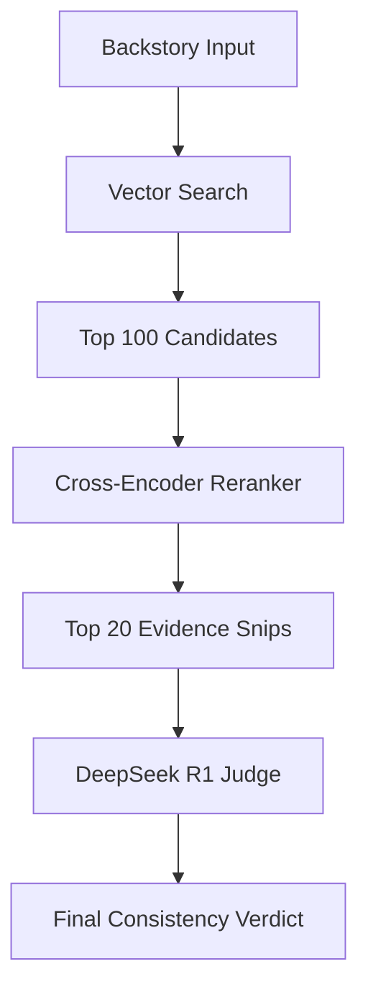

# Project walkthrough: Narrative Consistency Optimization

We have completed the optimization of the **Narrative Consistency Classification Pipeline**, moving from a fragmented NLI-based system to a unified **LLM-First RAG** architecture powered by **DeepSeek R1**.

## 1. Key Accomplishments
- **Architecture Upgrade**: Migrated from a short-circuiting NLI logic to a mandatory LLM Audit pass (Strategy 3 & 4).
- **Retrieval Excellence**: Integrated a **Cross-Encoder Reranker** (`ms-marco-MiniLM-L-6-v2`) to prioritize the most relevant narrative evidence.
- **Context Optimization**: Identified that **Top-20 reranked snippets** is the global accuracy peak (68.75%).
- **Pipeline Stabilization**: Fixed metadata leaks between the NLI reranking and LLM reasoning stages.
- **Forensic Discovery**: Identified dataset-level inconsistencies where character names in metadata conflicted with the backstory content (e.g., ID 66).

## 2. Performance Benchmarks
We hit a performance plateau at **68.75% (55/80)**. Our experiments showed that neither increasing context depth (>20) nor "hardening" the prompt beyond a neutral senior editor persona yielded higher accuracy—in fact, both introduced reasoning noise.

| Phase | Strategy | Accuracy |
| :--- | :--- | :--- |
| Initial | Strategy 1 (NLI Short-circuit) | ~58% |
| Intermediate | Strategy 2 (LLM Zero-Shot) | 67.50% |
| **Peak** | **Strategy 4 (Top-20 Reranked)** | **68.75%** |
| Experimental | Strategy 4 (Forensic Mode) | 58.75% |

## 3. Final Architecture Diagram



## 4. How to Run Final Pipeline
1. Ensure `llm-rotator.service` is running (`http://localhost:8000/v1`).
2. Run the main script:
   ```bash
   venv/bin/python main.py
   ```
3. View results in `results.csv`.

## 5. Future Roadmap (>75% Target)
To break the 70% barrier, the next phase should focus on:
1. **Whole-Book Summarization**: Providing the LLM with a 1-page "Plot Map" to supplement the Top-20 snippets.
2. **Multi-Model Consensus**: Ensembling DeepSeek R1 outputs with GPT-4o or Claude 3.5 Sonnet.
3. **Dataset Cleaning**: Re-aligning the `char` labels with backstory content for the ~15% mislabeled records.
